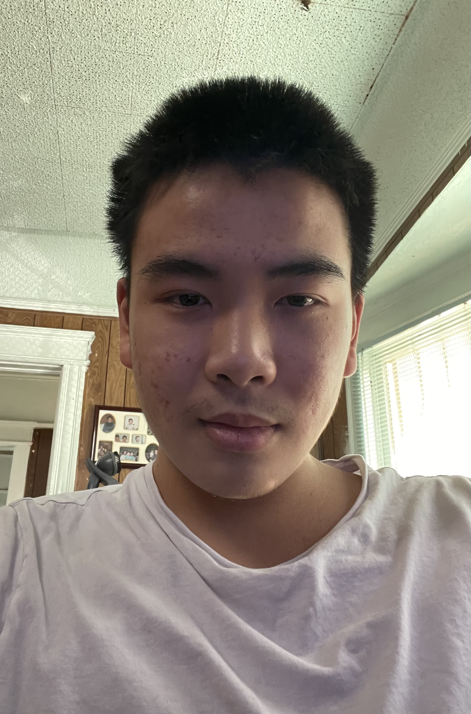

# practice-Andy-H

Hello I'm Andy, an incoming math-cs major going into Revelle. 

I'm from East LA and have been living there for the entirety of my life, leaving sometimes to visit family in China. 

I like playing video games and so I already spent a huge part of my life on the computer. I want to learn computers skills from SPIS and actually apply them to the real
world. This could be finding a job, creating awesome and interesting projects, and getting used to the quarter system at UCSD.

I hope to make friends at the SPIS game nights because I have not done any socializing for the entire summer. I enjoy playing party games and hate Valorant.

